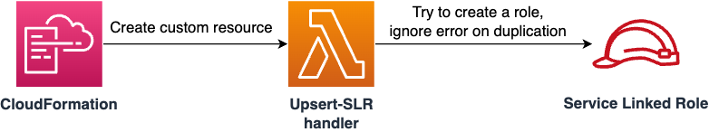

# Upsert Service-Linked Role
AWS CDK construct to create a [service-linked role (SLR)](https://docs.aws.amazon.com/IAM/latest/UserGuide/using-service-linked-roles.html) if there is no SLR for the same service, and if there is, skip the creation process.



## Features
* Create a service-linked role. If it is already created in the same AWS account, just skip the creation.
* Standalone CFn template since no CDK assets are used. We use inline code for the Lambda function.
* Sleep some time after role creation to wait for IAM propagation.

## Usage
```sh
npm install upsert-slr
```

```ts
import { ServiceLinkedRole } from 'upsert-slr';

new ServiceLinkedRole(this, 'ElasticsearchSlr', {
    awsServiceName: 'es.amazonaws.com',
    description: 'Service linked role for Elasticsearch',
});
```

## Why do we need this?
CloudFormation also supports a service-linked role ([doc](https://docs.aws.amazon.com/ja_jp/AWSCloudFormation/latest/UserGuide/aws-resource-iam-servicelinkedrole.html)). Why do we need this?

Because the resource behaves strangely when there is already a role with the same name. All we need is to simply create a role, and skip it if it already exists. Such behavior as upsert is achieved by this construct, `upsert-slr`.

Also, even if CFn successfully creates a role, resources that depend on the role sometimes fail to be created because there is sometimes a delay before the role is actually available. See [this stack overflow](https://stackoverflow.com/questions/20156043/how-long-should-i-wait-after-applying-an-aws-iam-policy-before-it-is-valid) for more details.

To avoid the IAM propagation delay, this construct also waits for some time after a role is created.
